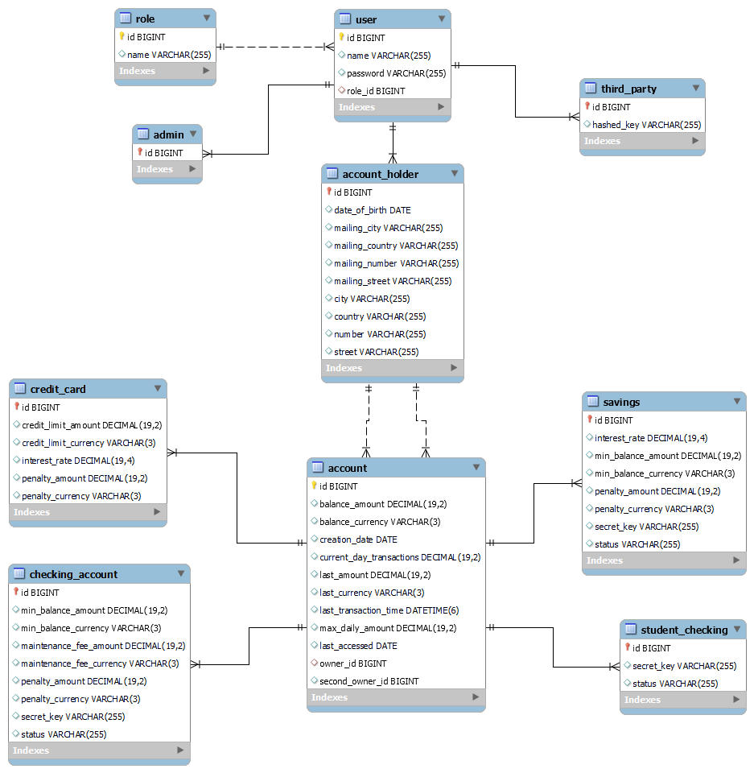

#💲Banking System
###_Ironhack Bootcamp Midterm Project_

##📌Features

-[x] **Register three types of user to access basic functionalities:**
    * Admin, third party and account holders
-[x] **Create four types of account:**
    * Checking, Student Checking, Savings and Credit Card
-[x] **Perform basic banking actions:**
    * Transfer from one account to another, allow third party transactions, interest and
      penalty fees apply automatically when it is required.
-[x] **Authentication with Basic Auth**
-[x] **Fraud detection**
-[x] **Data persistence**

##📋Tech

* _SpringBoot_
* _Spring Data JPA_
* _Spring MVC_
* _SpringBoot Validation_
* _Spring Security_ - Authentication
* _Maven_ - Dependencies management
* _JUnit_ - Integration and unitary tests

## :exclamation:Requirements
This project uses **Java 11**. Please make sure you have it installed, or you could run into compatibility issues.

You will also need a **database** for data persistence. The application configuration uses the **MySQL** driver, but you can
change it to another database of your choice.

## :computer:Getting started

Clone this repository using the `git clone https://github.com/miryam-tp/Banking-System-Ironhack <directory>` command on your terminal. Replace `<directory>` with
the directory you want.  

Edit the `application.properties` file to include the driver of your choice and your own username and password,
as well as the name of the schema you will be using to run the program.

Run the database script that is included in the project to create the necessary schemas.

##❓How to use
The application supports the next URIs:

| URI | Type of request | Parameters |  Access/Role |  Function  |
| ------ | ------ | ------ | ------ |  ------ |
| /users | POST | Body: UserDTO | Admin |  Stores a new user |
| /accounts | POST | Body: AccountDTO | Admin | Stores a new account |
| /accounts/{id} | GET | Path variable: account ID | Admin / Accountholder | Returns an account's balance |
| /accounts/{id} | PUT | Path variable: account ID. Body: BalanceDTO | Admin | Updates an account's balance |
| /accounts/transfer | PUT | Body: TransferDTO | Accountholder | Transfers money from an account to another |
| /accounts/third-party | PUT | Header: hashed key. Body: TransferDTO | Any | Receive or transfer money |

When storing an account holder, the DTO must contain the date of birth in the following format: `DD-MM-YYYY`

Third party users need to be registered in the database by an admin, but they do not need to log in to access the application.
Therefore, the UserDTO when registering a third party user does not need a password. However, it will need a hashed key that must be
provided as a header in the requests they make.

##💬Diagrams
You can find all the diagrams in the [diagrams](diagrams) folder.
###Use Case Diagram

###Class diagram

###Database structure

##🔜What's next?
Some things I would like to improve in this project:
- Transaction persistence in the database
- Better fraud detection
- Better Money class implementation

##✨Thanks
This project was developed in two weeks as part of the Ironhack Bootcamp.
This would not be possible without the help and dedication of the teacher and TAs. Thank you! ♥
#### IH ES WDPT - JUN21 - BECAS SANTANDER TECH